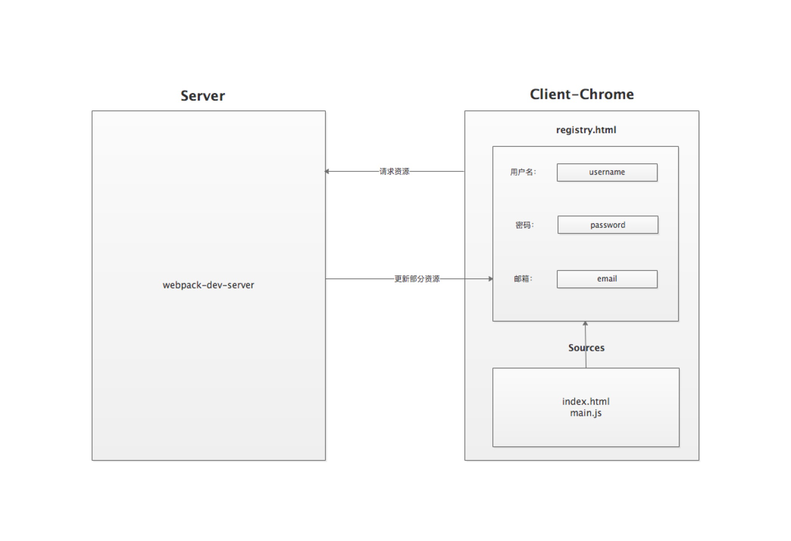

# 搞懂webpack热更新原理

## 目录

- HMR简单介绍
  - 是什么东西
  - 为什么需要他
  - 有没有更好的方案
- HMR简单使用
  - 如何配置
  - 有什么优势
- 一层层剥开
  - webpack的模块规范
    - 核心实现详解
    - commonjs的require规范实现 - 为自己的博客引流
  - webpack编译流程 - 为自己的博客引流
    - balabala
  - HMR流程图
    

## TODO

- 

## HMR是什么

`HMR`即`Hot Module Replacement`是指当你对代码修改并保存后，`webpack`将会对代码进行重新打包，并将改动的模块发送到浏览器端，浏览器用新的模块替换掉旧的模块，去实现局部更新页面而非整体刷新页面。

### 使用场景

如上图所示，一个注册页面包含`用户名`、`密码`、`邮箱`三个必填输入框，以及一个`提交`按钮，当你在调试`邮箱`模块改动了代码时，没做任何处理情况下是会刷新整个页面，频繁的改动代码会浪费你大量时间去重新填写内容。预期是保留`用户名`、`密码`的输入内容，而只替换`邮箱`这一模块。这一诉求就需要借助`webpack-dev-server`的热模块更新功能。

相对于`live reload`整体刷新页面的方案，`HMR`的优点在于可以保存应用的状态，提高开发效率。

## 配置使用HMR

### 配置webpack

- 简单配置

### 解析webpack打包后的文件内容

- webpack自己实现的一套commonjs规范讲解
- 区分commonjs和esmodule

### 配置HMR

## HMR原理

