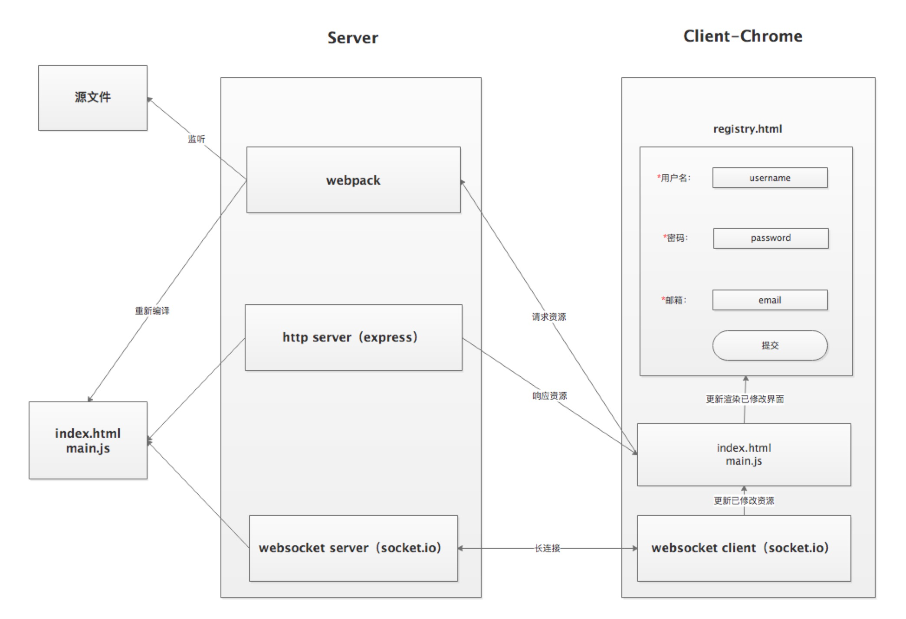

# 搞懂webpack热更新原理

## 目录

- HMR简单介绍
  - 是什么东西
  - 为什么需要他
  - 有没有更好的方案
- HMR简单使用
  - 如何配置
  - 有什么优势
- 一层层剥开
  - webpack的模块规范
    - 核心实现详解
    - commonjs的require规范实现 - 为自己的博客引流
  - webpack编译流程 - 为自己的博客引流
    - balabala
  - HMR流程图
    

## TODO

- 

## HMR是什么

`HMR`即`Hot Module Replacement`是指当你对代码修改并保存后，`webpack`将会对代码进行重新打包，并将改动的模块发送到浏览器端，浏览器用新的模块替换掉旧的模块，去实现局部更新页面而非整体刷新页面。

### 使用场景


如上图所示，一个注册页面包含`用户名`、`密码`、`邮箱`三个必填输入框，以及一个`提交`按钮，当你在调试`邮箱`模块改动了代码时，没做任何处理情况下是会刷新整个页面，频繁的改动代码会浪费你大量时间去重新填写内容。预期是保留`用户名`、`密码`的输入内容，而只替换`邮箱`这一模块。这一诉求就需要借助`webpack-dev-server`的热模块更新功能。

相对于`live reload`整体刷新页面的方案，`HMR`的优点在于可以保存应用的状态，提高开发效率。

## 配置使用HMR

### 配置webpack

首先借助`webpack`搭建项目

- 初识化项目并导入依赖
```shell
mkdir webpack-hmr && cd webpack-hmr
npm i -y
npm i -S webpack webpack-cli webpack-dev-server html-webpack-plugin
```

- 配置文件`webpack.config.js`
```js
const path = require('path')
const webpack = require('webpack')
const htmlWebpackPlugin = require('html-webpack-plugin')

module.exports = {
  mode: 'development', // 开发模式不压缩代码，方便调试
  entry: './src/index.js', // 入口文件
  output: {
    path: path.join(__dirname, 'dist'),
    filename: 'main.js'
  },
  devServer: {
    contentBase: path.join(__dirname, 'dist')
  },
  plugins: [
    new htmlWebpackPlugin({
      template: './src/index.html',
      filename: 'index.html'
    })
  ]
}
```

- 新建`src/index.html`模板文件
```js
<!DOCTYPE html>
<html lang="en">
<head>
  <meta charset="UTF-8">
  <meta name="viewport" content="width=device-width, initial-scale=1.0">
  <meta http-equiv="X-UA-Compatible" content="ie=edge">
  <title>Webpack Hot Module Replacement</title>
</head>
<body>
  <div id="root"></div>
</body>
</html>
```

- 新建`src/index.js`入口文件编写简单逻辑
```js
var root = document.getElementById('root')
function render () {
  root.innerHTML = require('./content.js')
}
render()
```

- 新建依赖文件`src/content.js`导出字符供index渲染页面
```js
var ret = 'Hello Webpack Hot Module Replacement'
module.exports = ret
// export default ret
```

- 配置`package.json`
```json
  "scripts": {
    "dev": "webpack-dev-server",
    "build": "webpack"
  }
```

- 然后`npm run dev`即可启动项目

- 通过`npm run build`打包生成静态资源到`dist`目录

接下来先分析下`dist`目录中的文件

### 解析webpack打包后的文件内容

- webpack自己实现的一套commonjs规范讲解
- 区分commonjs和esmodule

dist目录结构
```shell
.
├── index.html
└── main.js
```
#### 其中`index.html`内容如下
```html
<!-- ... -->
<div id="root"></div>
<script type="text/javascript" src="main.js"></script></body>
<!-- ... -->
```
使用`html-webpack-plugin`插件将入口文件及其依赖通过`script`标签引入

#### 先对`main.js`内容去掉注释和无关内容进行分析
```js
(function (modules) { // webpackBootstrap
  // ...
})
({
  "./src/content.js":
    (function (module, exports) {
      eval("var ret = 'Hello Webpack Hot Module Replacement'\n\nmodule.exports = ret\n// export default ret\n\n");
    }),
  "./src/index.js": (function (module, exports, __webpack_require__) {
    eval("var root = document.getElementById('root')\nfunction render () {\n  root.innerHTML = __webpack_require__(/*! ./content.js */ \"./src/content.js\")\n}\nrender()\n\n\n");
  })
});
```
可见webpack打包后会产出一个自执行函数，其参数为一个对象
```js
"./src/content.js": (function (module, exports) {
  eval("...")
}
```
键为入口文件或依赖文件相对于根目录的相对路径，值则是一个函数，其中使用`eval`执行文件的内容字符。

- 再进入自执行函数体内，可见webpack自己实现了一套`commonjs`规范
```js
(function (modules) {
  // 模块缓存
  var installedModules = {};
  function __webpack_require__(moduleId) {
    // 判断是否有缓存
    if (installedModules[moduleId]) {
      return installedModules[moduleId].exports;
    }
    // 没有缓存则创建一个模块对象并将其放入缓存
    var module = installedModules[moduleId] = {
      i: moduleId,
      l: false, // 是否已加载
      exports: {}
    };
    // 执行模块函数
    modules[moduleId].call(module.exports, module, module.exports, __webpack_require__);
    // 将状态置为已加载
    module.l = true;
    // 返回模块对象
    return module.exports;
  }
  // ...
  // 加载入口文件
  return __webpack_require__(__webpack_require__.s = "./src/index.js");
})
```
> 如果对上面`commonjs`规范感兴趣可以前往我的另一篇文章[手摸手带你实现commonjs规范]()

给出上面代码主要是先对webpack的产出文件混个眼熟，不要惧怕。其实任何一个不管多复杂的事物都是由更小更简单的东西组成，剖开它认识它爱上它。

### 配置HMR

接下来配置并感受一下热更新带来的便捷开发
```js
// webpack.config.js
  // ...
  devServer: {
    hot: true
  }
  // ...
```

```js
// ./src/index.js
// ...
if (module.hot) {
  module.hot.accept(['./content.js'], () => {
    render()
  })
}
```
当更改`./content.js`的内容并保存时，可以看到页面没有刷新，但是内容已经被替换了。

这对提高开发效率意义重大。接下来将一层层剖开它，认识它的实现原理。

## HMR原理



如上图所示，`Server`端使用`webpack-dev-server`去启动本地服务，内部实现主要使用了`webpack`、`express`、`websocket`。

- 使用`express`启动本地服务，当浏览器访问资源时对此做响应。
- 服务端和客户端使用`websocket`实现长连接
- `webpack`监听源文件的变化，即当开发者保存文件时触发`webpack`的重新编译。
  - 每次编译都会生成一个`hash戳`以及文件
  - 编译完成后通过`socket`向客户端推送当前编译的`hash戳`
- 客户端的`websocket`监听到有文件改动推送过来的`hash戳`，会和上一次对比
  - 一致则走缓存
  - 不一致则通过`ajax`和`jsonp`向服务端获取最新资源
- 使用`内存文件系统`去替换有修改的内容实现局部刷新

## debug服务端源码

debug源码分析其详细思路

1. 启动`webpack-dev-server`服务器，源代码地址[@webpack-dev-server/webpack-dev-server.js#L173](https://github.com/webpack/webpack-dev-server/blob/v3.7.2/bin/webpack-dev-server.js#L173)
1. 创建webpack实例，源代码地址[@webpack-dev-server/webpack-dev-server.js#L89](https://github.com/webpack/webpack-dev-server/blob/v3.7.2/bin/webpack-dev-server.js#L89)
1. 创建Server服务器，源代码地址[@webpack-dev-server/webpack-dev-server.js#L107](https://github.com/webpack/webpack-dev-server/blob/v3.7.2/bin/webpack-dev-server.js#L107)
1. 添加webpack的done事件回调，源代码地址[@webpack-dev-server/Server.js#L122](https://github.com/webpack/webpack-dev-server/blob/v3.7.2/lib/Server.js#L122)
  1. 编译完成向客户端发送消息，源代码地址[@webpack-dev-server/Server.js#L184](https://github.com/webpack/webpack-dev-server/blob/v3.7.2/lib/Server.js#L184)
1. 创建express应用app，源代码地址[@webpack-dev-server/Server.js#L123](https://github.com/webpack/webpack-dev-server/blob/v3.7.2/lib/Server.js#L123)
1. 设置文件系统为内存文件系统，源代码地址[@webpack-dev-middleware/fs.js#L115](https://github.com/webpack/webpack-dev-middleware/blob/v3.7.0/lib/fs.js#L115)
1. 添加webpack-dev-middleware中间件，源代码地址[@webpack-dev-server/Server.js#L125](https://github.com/webpack/webpack-dev-server/blob/v3.7.2/lib/Server.js#L125)
  1. 中间件负责返回生成的文件，源代码地址[@webpack-dev-middleware/middleware.js#L20](https://github.com/webpack/webpack-dev-middleware/blob/v3.7.0/lib/middleware.js#L20)
1. 启动webpack编译，源代码地址[@webpack-dev-middleware/index.js#L51](https://github.com/webpack/webpack-dev-middleware/blob/v3.7.0/index.js#L51)
1. 创建http服务器并启动服务，源代码地址[@webpack-dev-server/Server.js#L135](https://github.com/webpack/webpack-dev-server/blob/v3.7.2/lib/Server.js#L135)
1. 使用sockjs在浏览器端和服务端之间建立一个 websocket 长连接，源代码地址[@webpack-dev-server/Server.js#L745](https://github.com/webpack/webpack-dev-server/blob/v3.7.2/lib/Server.js#L745)
  1. 创建socket服务器，源代码地址[@webpack-dev-server/SockJSServer.js#L34](https://github.com/webpack/webpack-dev-server/blob/v3.7.2/lib/servers/SockJSServer.js#L34)

### 简易实现

上面是我通过debug得出dev-server运行流程比较核心的几个点，下面将其[抽象成一个文件](./dev-server.js)。

#### 启动webpack-dev-server服务器
先导入所有依赖
```js
const path = require('path') // 解析文件路径
const express = require('express') // 启动本地服务
const mime = require('mime') // 获取文件类型 实现一个静态服务器
const webpack = require('webpack') // 读取配置文件进行打包
const MemoryFileSystem = require('memory-fs') // 使用内存文件系统更快，文件生成在内存中而非真实文件
const config = require('./webpack.config') // 获取webpack配置文件
```

#### 创建webpack实例
```js
const compiler = webpack(config)
```
compiler代表整个webpack编译任务，全局只有一个

#### 创建Server服务器
```js
class Server {
  constructor(compiler) {
    this.compiler = compiler
  }
  listen(port) {
    this.server.listen(port, () => {
      console.log(`服务器已经在${port}端口上启动了`)
    })
  }
}
let server = new Server(compiler)
server.listen(8000)
```

#### 添加webpack的done事件回调

```js
  constructor(compiler) {
    let sockets = []
    let lasthash
    compiler.hooks.done.tap('webpack-dev-server', (stats) => {
      lasthash = stats.hash
      // 每当新一个编译完成后都会向客户端发送消息
      sockets.forEach(socket => {
        socket.emit('hash', stats.hash) // 先向客户端发送最新的hash值
        socket.emit('ok') // 再向客户端发送一个ok
      })
    })
  }
```
`webpack`编译后提供提供了一系列钩子函数，以供插件能访问到它的各个生命周期节点，并对其打包内容做修改。`compiler.hooks.done`则是插件能修改其内容的最后一个节点。

编译完成通过`socket`向客户端发送消息，推送每次编译产生的`hash`。另外如果是热更新的话，还会产出二个补丁文件，里面描述了从上一次结果到这一次结果都有哪些chunk和模块发生了变化。

使用`let sockets = []`数组去存放当打开了多个Tab时每个Tab的`socket实例`。

#### 创建express应用app
```js
let app = new express()
```
#### 设置文件系统为内存文件系统
```js
let fs = new MemoryFileSystem()
```
如果你把compiler的输出文件系统改成了 MemoryFileSystem的话，则以后再产出文件都打包内存里去了
#### 添加webpack-dev-middleware中间件
```js
  function middleware(req, res, next) {
    if (req.url === '/favicon.ico') {
      return res.sendStatus(404)
    }
    // /index.html   dist/index.html
    let filename = path.join(config.output.path, req.url.slice(1))
    let stat = fs.statSync(filename)
    if (stat.isFile()) { // 判断是否存在这个文件,如果在的话直接把这个读出来发给浏览器
      let content = fs.readFileSync(filename)
      let contentType = mime.getType(filename)
      res.setHeader('Content-Type', contentType)
      res.statusCode = res.statusCode || 200
      res.send(content)
    } else {
      return res.sendStatus(404)
    }
  }
  app.use(middleware)
```
使用expres启动了本地开发服务后，使用中间件去为其构造一个静态服务器，并使用了内存文件系统，使读取文件后存放到内存中，提高读写效率，最终返回生成的文件。

#### 启动webpack编译
```js
  compiler.watch({}, err => {
    console.log('又一次编译任务成功完成了')
  })
```
以监控的模块启动一次webpack编译，当编译成功之后执行回调

#### 创建http服务器并启动服务

```js
  constructor(compiler) {
    // ...
    this.server = require('http').createServer(app)
    // ...
  }
  listen(port) {
    this.server.listen(port, () => {
      console.log(`服务器已经在${port}端口上启动了`)
    })
  }
```

#### 使用sockjs在浏览器端和服务端之间建立一个 websocket 长连接

```js
  constructor(compiler) {
    // ...
    this.server = require('http').createServer(app)
    let io = require('socket.io')(this.server)
    io.on('connection', (socket) => {
      sockets.push(socket)
      socket.emit('hash', lastHash)
      socket.emit('ok')
    })
  }
```
启动一个 websocket服务器，然后等待连接来到，连接到来之后存进sockets池

当有文件改动，webpack重新编译时，向客户端推送`hash`和`ok`两个事件

### 调试阶段

感兴趣的可以根据上面[debug服务端源码](#debug服务端源码)所带的源码位置，并在浏览器的调试模式下设置断点查看每个阶段的值。

```shell
node dev-server.js
```
使用我们自己编译的`dev-server.js`启动服务，可看到页面可以正常展示，但还没有实现热更新。

下面将调式客户端的源代码分析其实现流程。

## debug客户端源码

- socket
- 发布订阅
- ajax jsonp
  - 为什么不使用socket直接获取差异代码呢？因为拉代码过来可以直接执行
